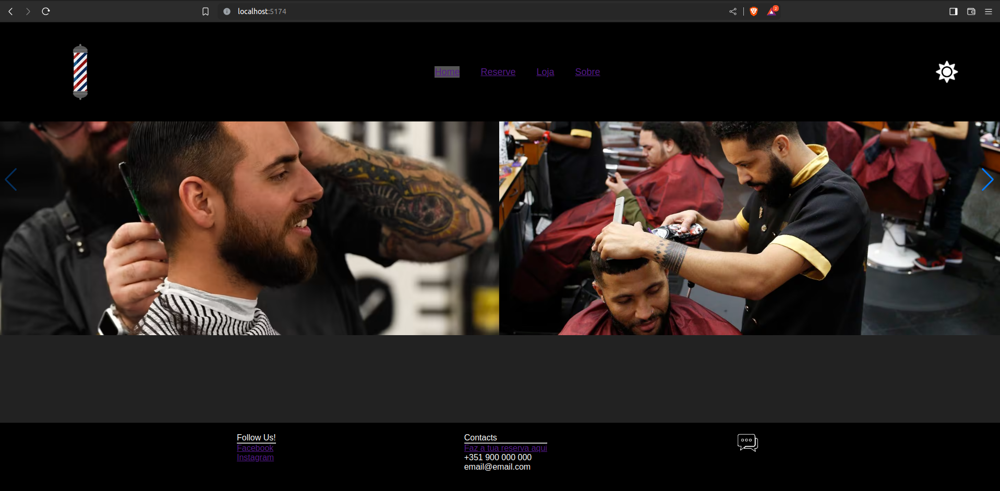
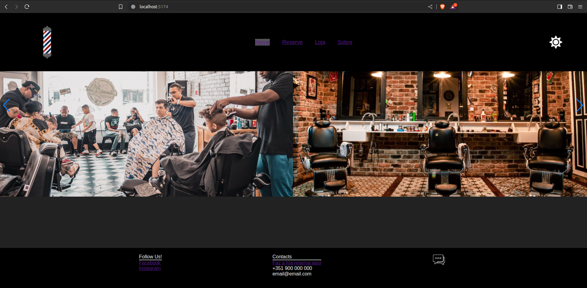
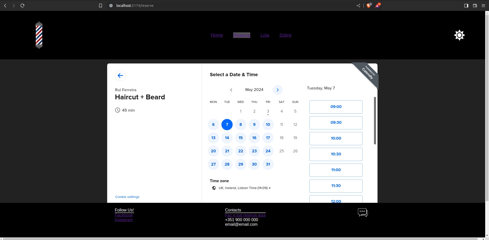
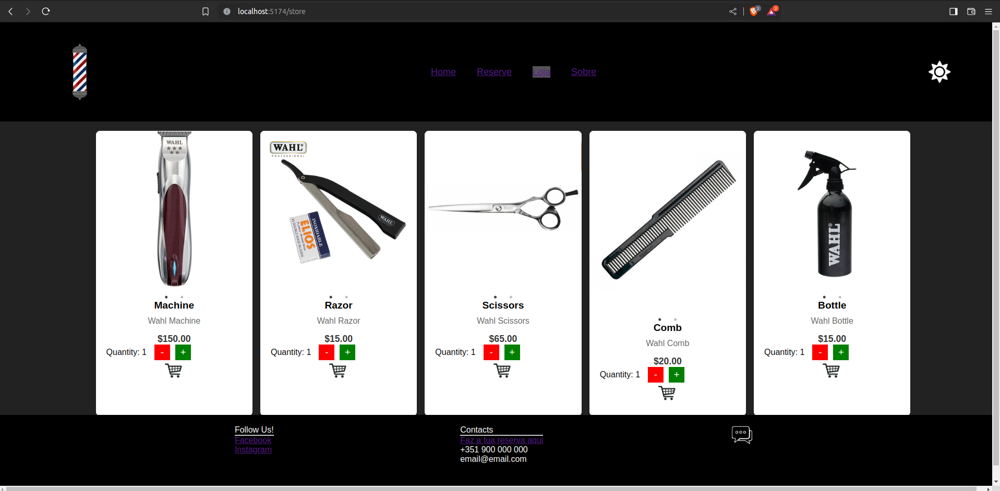
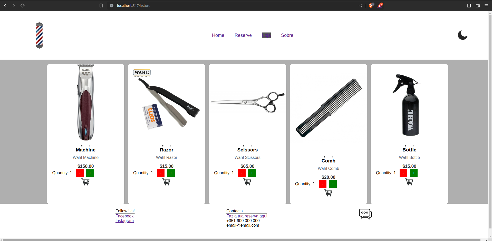
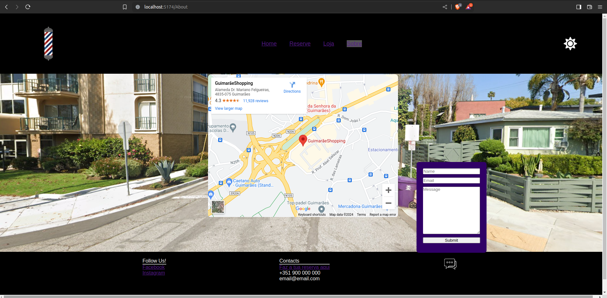

# Barber Shop Reserve & Store Website

This project is a website for a barber shop, featuring a reservation system and an online store.

## Overview

Barber Shop Reserve & Store Website is designed to facilitate appointments and showcase products for a barber shop. It includes features such as a reservation system integrated with Calendly and an online store for purchasing barber tools and accessories.

## Features

- Home page with a carousel using the Swiper library.
- Reserve page integrated with Calendly for scheduling appointments.
- Store page displaying various products.
- About page providing information about the barber shop.

## Technologies

- JavaScript
- React.js
- Swiper.js
- Calendly API
- CSS3

## Usage

To use this project, simply navigate to the corresponding pages using the links provided in the navigation bar. Users can reserve appointments on the Reserve page and browse available products in the Store page.

## Screenshots

